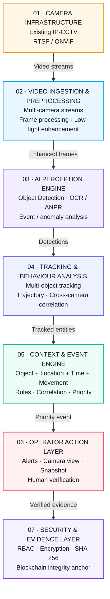
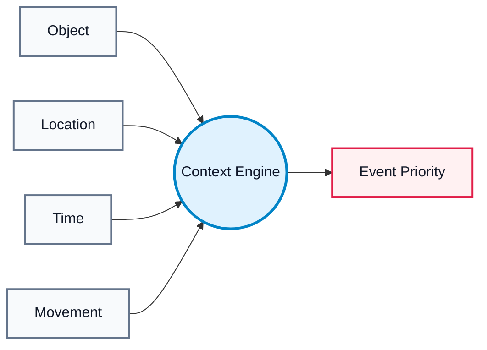
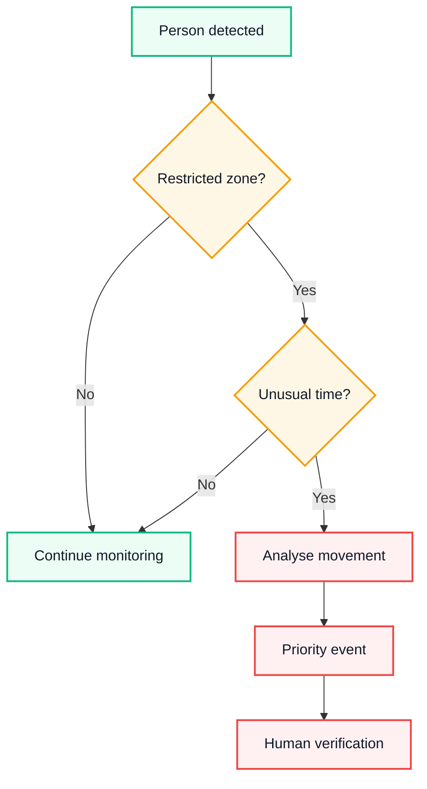
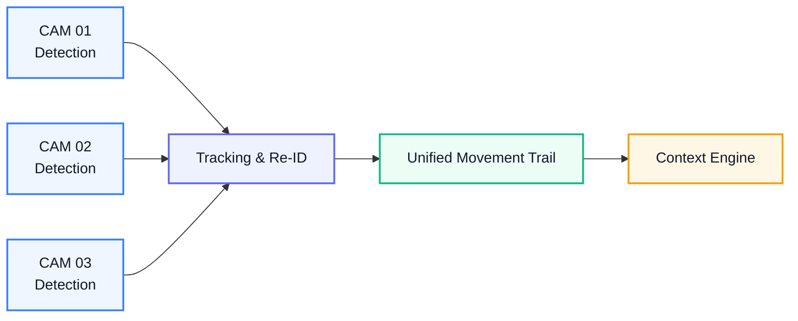
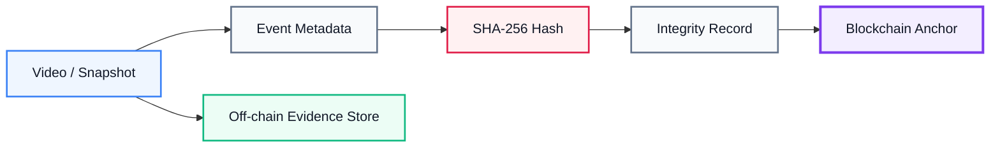
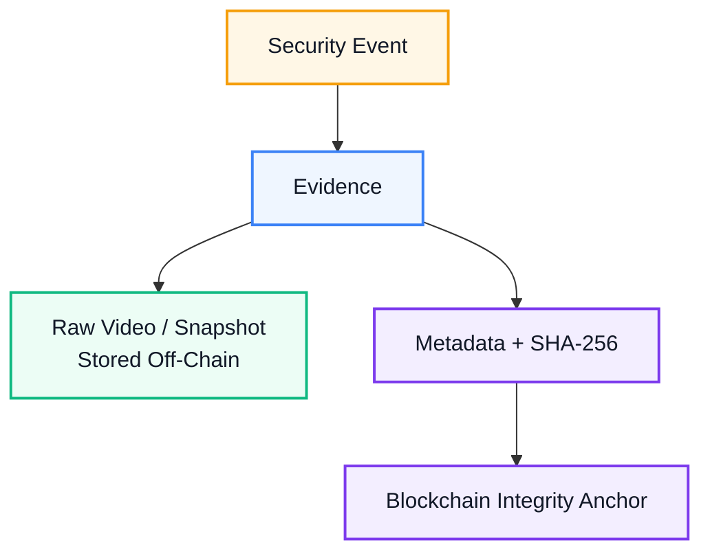

<div align="center">

# DRISHTI AI

### Intelligent Video Analytics Platform for Border Surveillance

**Smart India Hackathon 2026 · SIH26187**

<p>
  
  
  
  
</p>

**Team Sudo -l · Team ID: 137482**

*Turning existing CCTV infrastructure into an intelligent, context-aware and auditable surveillance layer.*

<!-- VISUAL HERO -->

| **01 · PERCEIVE** | **02 · UNDERSTAND** | **03 · RESPOND** | **04 · PROVE** |
|:---:|:---:|:---:|:---:|
| CCTV STREAMS | CONTEXT ENGINE | PRIORITY ALERTS | SECURE EVIDENCE |
| RTSP / ONVIF | Object + Location + Time + Movement | Human Verification | SHA-256 + Blockchain |

<br>

**Existing Cameras → AI Intelligence → Contextual Alerts → Verifiable Evidence**

</div>

---

## Overview

**Drishti AI** is an AI-powered video analytics platform designed for intelligent surveillance using **existing IP-CCTV infrastructure**.

Instead of replacing deployed cameras, Drishti adds an intelligence layer that processes video streams, detects relevant objects, tracks movement, understands event context, prioritizes security events and preserves evidence with cryptographic integrity.

### Core Pipeline

```text
CAMERA
   ↓
VIDEO INGESTION
   ↓
AI PERCEPTION
   ↓
TRACKING
   ↓
CONTEXT ANALYSIS
   ↓
EVENT PRIORITY
   ↓
HUMAN VERIFICATION
   ↓
SECURE EVIDENCE
   ↓
SHA-256 + BLOCKCHAIN ANCHOR
```

> **Detect → Track → Understand → Alert → Verify → Preserve**

---

# Problem Statement

Traditional CCTV systems primarily operate as **passive recording infrastructure**.

Large surveillance networks generate continuous video streams, but human operators cannot continuously analyze every feed. This creates challenges such as:

- Manual monitoring dependency
- Missed or delayed detection
- Alert overload
- Isolated camera views
- Difficulty tracking movement across cameras
- Limited contextual understanding of events
- Evidence integrity concerns

Drishti AI addresses these limitations by adding a **software-defined intelligence layer** to existing IP-CCTV infrastructure.

---

# Our Solution

Drishti AI converts raw camera streams into **context-aware security events**.

### From

```text
Camera → Recording → Manual Investigation
```

### To

```text
Camera
   ↓
AI Analysis
   ↓
Tracking
   ↓
Context
   ↓
Risk / Priority
   ↓
Human Verification
   ↓
Auditable Evidence
```

The platform is designed around five major capabilities:

| Capability | Purpose |
|---|---|
| **AI Perception** | Detect and classify relevant objects/events |
| **Cross-Camera Tracking** | Correlate movement across cameras |
| **Context Engine** | Understand object + location + time + movement |
| **Human Verification** | Keep operators in the decision loop |
| **Secure Evidence** | Maintain cryptographically verifiable records |

---

# System Architecture

<div align="center">
</div>

### Architecture at a Glance

```text
┌──────────────┐     ┌──────────────┐     ┌──────────────┐
│ EXISTING CCTV│ ──▶ │   AI ENGINE  │ ──▶ │ CONTEXT      │
│ RTSP / ONVIF │     │ Detect/Track │     │ + PRIORITY   │
└──────────────┘     └──────────────┘     └──────┬───────┘
                                                  │
                                                  ▼
┌──────────────┐     ┌──────────────┐     ┌──────────────┐
│ AUDIT TRAIL  │ ◀── │ SHA-256 HASH │ ◀── │ HUMAN VERIFY │
│ BLOCKCHAIN   │     │ INTEGRITY    │     │ + ALERT      │
└──────────────┘     └──────────────┘     └──────────────┘
```

### Seven-Layer Architecture



---

# Technology Stack

<div align="center">

### AI / Computer Vision

### Tracking / Analytics

### Backend / Infrastructure

### Camera / Security

</div>

<!-- TECH VISUAL -->

### Stack at a Glance

| **VIDEO** | **AI / CV** | **SECURITY** | **INFRASTRUCTURE** |
|---|---|---|---|
| RTSP | YOLOv8 | SHA-256 | Python |
| ONVIF | OpenCV | Blockchain | FastAPI |
| IP-CCTV | DeepSORT | RBAC | Docker |
| Video Streams | OCR / ANPR | Encryption | Edge GPU |

## Technology → Responsibility

| Technology | Role in Drishti |
|---|---|
| **Python** | AI and system development |
| **YOLOv8** | Real-time object detection |
| **OpenCV** | Video/frame processing |
| **PyTorch / TensorFlow** | ML model execution |
| **DeepSORT** | Multi-object tracking |
| **CRNN / OCR** | Number-plate recognition pipeline |
| **FastAPI** | Backend/API direction |
| **SQLite** | Local metadata storage |
| **RTSP** | IP-camera video streaming |
| **ONVIF** | Camera interoperability |
| **Docker** | Containerized deployment |
| **Kubernetes** | Future scalable deployment |
| **SHA-256** | Evidence integrity |
| **Blockchain** | Tamper-evident audit anchoring |
| **Edge GPU** | Near-source inference |

> **Note:** The stack represents the technical direction of the SIH solution. Components are being implemented progressively and should not be interpreted as production-deployed unless explicitly marked as such.

---

# How Drishti Works

## 01 — Camera Integration

Drishti connects with existing IP-CCTV infrastructure.

```text
Existing Camera
      │
      ├── RTSP
      │
      └── ONVIF
             ↓
      Drishti Ingestion
```

No replacement of the existing camera infrastructure is required in the proposed architecture.

---

## 02 — Video Preprocessing

Incoming streams are prepared for AI analysis.

Processing can include:

- Frame extraction
- Stream handling
- Low-light enhancement
- Noise reduction
- Image quality enhancement

---

## 03 — AI Perception

The AI layer detects relevant entities from video.

```text
Video Frame
     ↓
Object Detection
     ↓
┌──────────┬──────────┬──────────┐
│ Person   │ Vehicle  │ Plate    │
└──────────┴──────────┴──────────┘
```

---

## 04 — Tracking

Detections are converted into continuous movement trajectories.

```text
CAM 01
  ↓
Person detected
  ↓
CAM 02
  ↓
Same trajectory
  ↓
CAM 03
  ↓
Movement continues
```

This allows the system to reason about **movement rather than isolated frames**.

---

# Context-Aware Intelligence

Detection alone does not determine whether an event is important.

Drishti combines four contextual signals:



### Example Decision Flow



This allows the platform to distinguish contextual security events from routine detections.

---

# Cross-Camera Intelligence

Instead of treating each camera as an isolated data source, Drishti is designed to correlate movement across connected cameras.



The objective is to build a unified understanding of:

**Object + Location + Time + Movement**

---

# Secure Evidence Architecture

Security incidents require evidence that can be verified later.

Drishti separates **bulk evidence storage** from **integrity verification**.



### Storage Principle



This avoids storing large video files directly on-chain while maintaining an integrity reference for the evidence.

---

# Security Layer

Security is built into the architecture.

### RBAC

Role-Based Access Control for authorized operators.

### Encryption

Protection of sensitive data in transit and at rest.

### SHA-256

Cryptographic hashing for evidence integrity verification.

### Blockchain Audit

Hash and metadata anchoring for a tamper-evident audit trail.

---

# Human-in-the-Loop

Drishti AI is designed as a **decision-support system**, not an autonomous enforcement system.

```text
AI Detection
     ↓
Context Analysis
     ↓
Priority Alert
     ↓
Human Review
     ↓
Operator Decision
```

The operator receives the relevant context required to verify the event.

---

# Prototype

<div align="center">

## Drishti AI Monitoring Dashboard
</div>

### Prototype demonstrates

- Multi-camera monitoring
- Live-view concept
- Recent security alerts
- Event priority
- Camera status
- Detection statistics
- Operator-oriented interface

### Live Prototype

**https://frontend-jade-five-73.vercel.app**

> The current prototype demonstrates the intended operational interface. AI inference, production-scale deployment and blockchain integration are being developed according to the implementation roadmap.

---

# Operational Scenario

## Night-Time Restricted-Zone Intrusion


### Result

The system moves from:

> **"A person was detected."**

to:

> **"A potentially significant event occurred in a restricted zone at a specific time and location, with traceable evidence."**

---

# Edge & Connectivity Resilience

Border and remote surveillance environments may experience connectivity limitations.

Drishti's proposed architecture supports local edge processing.

### Normal

```text
Camera
  ↓
Edge AI
  ↓
Central Monitoring
```

### Network Disruption

```text
Camera
  ↓
Edge AI
  ↓
Local Event Buffer
  ↓
Local Operator
```

### Recovery

```text
Local Buffer
     ↓
Secure Synchronization
     ↓
Central Records
```

This architecture is intended to maintain local operational continuity during temporary connectivity loss.

---

# Current Status

<!-- STATUS VISUAL -->

### Project Maturity

```text
CONCEPT ───────── PROTOTYPE ───────── IMPLEMENTATION ───────── VALIDATION
   ●                    ●                    ◐                    ○
  Done                 Done               Active                Planned
```

| Component | Status |
|---|:---:|
| Problem Analysis | COMPLETE |
| System Architecture | COMPLETE |
| Technical Workflow | COMPLETE |
| UI Prototype | COMPLETE |
| Context-Aware Event Model | COMPLETE |
| Security Architecture | COMPLETE |
| Evidence Integrity Design | COMPLETE |
| RTSP/ONVIF Integration | IN PROGRESS |
| AI Detection Pipeline | IN PROGRESS |
| Multi-Object Tracking | IN PROGRESS |
| Cross-Camera Correlation | IN PROGRESS |
| Context Engine | IN PROGRESS |
| SHA-256 Evidence Pipeline | IN PROGRESS |
| Blockchain Integration | IN PROGRESS |
| Edge Deployment | PLANNED |
| End-to-End Testing | PLANNED |

### Legend

```text
**COMPLETE**  Designed / Demonstrated
**IN PROGRESS**  Under Implementation
**PLANNED**  Planned
```

---

# Development Roadmap

```mermaid
flowchart LR
    A["01<br/>Architecture"] --> B["02<br/>Prototype"]
    B --> C["03<br/>Video Ingestion"]
    C --> D["04<br/>AI Detection"]
    D --> E["05<br/>Tracking"]
    E --> F["06<br/>Context Engine"]
    F --> G["07<br/>Alerts"]
    G --> H["08<br/>Evidence Integrity"]
    H --> I["09<br/>Blockchain"]
    I --> J["10<br/>Edge Deployment"]
    J --> K["11<br/>End-to-End Demo"]

    classDef done fill:#ECFDF5,stroke:#10B981,color:#111827,stroke-width:2px;
    classDef progress fill:#FFF7E6,stroke:#F59E0B,color:#111827,stroke-width:2px;
    classDef future fill:#F8FAFC,stroke:#64748B,color:#111827,stroke-width:2px;

    class A,B done;
    class C,D,E,F,G,H progress;
    class I,J,K future;
```



---

# Research Foundation

The technical direction of Drishti is informed by research and established approaches in:

- Real-time object detection
- Multi-object tracking
- OCR / ANPR
- Surveillance anomaly detection
- Low-light image enhancement
- Edge AI
- Evidence integrity
- Blockchain audit systems

Relevant foundations include:

| Research / Technology | Application |
|---|---|
| **YOLOv8** | Object detection |
| **DeepSORT** | Multi-object tracking |
| **CRNN / OCR** | Number-plate recognition |
| **UCF-Crime** | Surveillance anomaly research |
| **LLVIP / ExDark** | Low-light processing |
| **Anti-UAV Research** | UAV detection research |

---

# Repository Structure

```text
Dristhi-AI/
│
├── README.md
├── LICENSE
├── SECURITY.md
├── .gitignore
├── .env.example
│
├── assets/
│
└── docs/
    ├── ARCHITECTURE.md
    ├── PROJECT_OVERVIEW.md
    ├── DEMO.md
    ├── IMPLEMENTATION_ROADMAP.md
    └── SIH_SCOPE.md
```

---

# SIH 2026

<div align="center">

### Smart India Hackathon 2026

**Problem Statement:** SIH26187

**AI-Based Intelligent Video Analytics Platform for Border Surveillance using Existing CCTV Infrastructure**

**Theme:** Blockchain & Cybersecurity  
**Category:** Software  
**Team:** Sudo -l  
**Team ID:** T57

</div>

---

<!-- SIH FOOTER -->

---

<div align="center">

### SMART INDIA HACKATHON 2026

**SIH26187 · Blockchain & Cybersecurity · Team 137482**

`Drishti AI` · `Sudo -l`

</div>

# Team

<div align="center">

### Sudo -l

**Smart India Hackathon 2026**

*Building Drishti AI — Intelligent Surveillance Through Existing Infrastructure*

</div>

---

# Vision

Traditional CCTV provides the **eyes**.

Drishti AI adds the **intelligence layer**.

```text
┌─────────────────────────────────────────────┐
│                                             │
│        EXISTING SURVEILLANCE NETWORK       │
│                    +                        │
│              DRISHTI AI                    │
│                    ↓                        │
│       CONTEXT-AWARE INTELLIGENCE            │
│                    +                        │
│          SECURE EVIDENCE                    │
│                                             │
└─────────────────────────────────────────────┘
```

> **Drishti AI is not a replacement for the surveillance network.  
> It is the intelligence layer designed to make existing surveillance infrastructure actionable, contextual and auditable.**

---

## Disclaimer

This repository represents the **SIH 2026 project concept, architecture, prototype and implementation roadmap**.

Features marked as **Under Implementation** or **Planned** should not be interpreted as production-ready functionality.

The system is intended for authorized security and surveillance environments with appropriate access control, privacy and operational safeguards.
